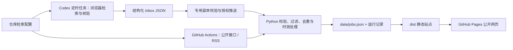

# 工作雷达 · Job Radar

可托管在 **GitHub Pages** 的招聘岗位整合站点，配套 **GitHub Actions + Codex 定时任务** 数据流水线。前端是原生 HTML/CSS/JavaScript，后端使用 Python 标准库，无数据库、无付费 API 依赖、无需 npm install。

**运行状态：已上线真实数据。** [打开工作雷达](https://billshiyaozhang.github.io/job-hunting/)。私有源码仓库为 `BillShiyaoZhang/job-hunting`；仅 `dist/` 发布到公开网页。默认范围：中国大陆技术岗，兼顾全球/亚洲可申请远程岗。GitHub Actions 每日北京时间 09:37 刷新；Codex 每日 09:10 核验受支持的浏览器来源并交接批次。详见 [运行说明](docs/automation.md)。

## 本地打开

站点默认打开介绍首页，包含使用步骤和统一配置入口。「岗位发现」可直接进入岗位列表；「检索配置 → 完整 JSON 配置」可编辑全部关键词、来源与策略的浏览器草稿。自动采集最终读取的文件始终是 `config/search.json`。

Windows PowerShell，在项目目录运行：

```powershell
.\scripts\local.ps1 serve
```

打开 [本地预览](http://127.0.0.1:8765/)。脚本优先识别 Codex 自带 Python，也支持 PATH 上的 Python。若端口被占用，可添加 `-Port 8766`。按 Ctrl+C 停止服务。

其他系统需要 Python 3.11+（推荐 3.12）：

```bash
python -m jobradar build
python -m http.server 8765 --bind 127.0.0.1 --directory dist
```

不要直接双击 `index.html`，页面通过 HTTP 加载 JSON。`dist/` 既是可维护的前端源文件目录，也是最终静态发布目录，所有路径均支持 `用户名.github.io/仓库名/` 子路径。

## 已包含的能力

- **岗位发现**：关键词搜索、地点/来源/远程方式/状态筛选、排序、分页、岗位详情和原文跳转。
- **招聘来源**：添加或编辑来源、启停开关、接口参数、来源专属检索策略。
- **检索配置**：关键词、排除词、地点、任意/全部匹配、检索字段、结果与页数上限、时效、超时、重试和请求间隔；支持 JSON 导入导出。
- **数据流水线**：腾讯官网、Greenhouse、Lever、Remotive、RSS/Atom、JSON-LD 职位页、Codex 核验批次；数据校验、URL 去重、来源溯源、旧批次重放保护、失败保留和复核期限。
- **运行记录**：每个来源的采集状态、读取/入选数量和问题说明，保留最近 30 次记录。
- **自动化运行**：只读 CI、每日刷新工作流、手动发布工作流、Codex 定时任务及专用副本批次推送。

网页中的配置保存为**浏览器本地草稿**，不会更改 GitHub 仓库或启动采集。导出 `search.json`，替换仓库的 `config/search.json`，再运行校验，才能供后端采用。不要把密码、Cookie 或令牌放入配置；构建后的配置公开可读。

## 命令

| 命令 | 用途 |
| --- | --- |
| `python -m jobradar validate` | 校验配置、岗位数据和待导入批次 |
| `python -m jobradar plan` | 输出启用来源的最终策略及 Codex 查询词 |
| `python -m jobradar collect` | 执行真实采集并合并 inbox；至少启用一个来源 |
| `python -m jobradar import /path/to/batch.json` | 校验 Codex 批次并保存到本地 inbox |
| `python -m jobradar build` | 更新静态数据，允许示例预览 |
| `python -m jobradar build --production` | 正式构建，拒绝示例数据 |
| `python -m jobradar demo` | 重建示例；默认不会覆盖正式数据 |
| `python -m unittest discover -s tests -v` | 后端离线测试 |
| `node --test tests/frontend.test.mjs` | 前端筛选及配置测试，需要 Node 20+ |
| `python scripts/check_site.py` | 检查静态文件清单和子路径兼容性 |

Windows 也可运行 `.\scripts\local.ps1 validate`、`plan`、`demo`、`collect`、`build`、`test`。使用其他配置时，将全局参数写在子命令之前：`python -m jobradar --config config/my-search.json plan`。

## 如何开始真实检索

1. 在「招聘来源」编辑目标来源。公开招聘板填写真实公司标识；BOSS、猎聘等使用 Codex 策略。
2. 在「检索配置」设置自己的关键词和地点，保存并导出配置到 `config/search.json`。
3. 运行 `validate` 和 `plan`，确认启用的来源和最终策略。
4. API/订阅源运行 `collect`；Codex 来源按任务模板核验岗位，然后 `import` 批次，再 `collect`。
5. 运行 `build` 并刷新本地页面。此过程不部署。

如只启用 Codex 来源、但没有任何可用批次，采集会显示等待或失败，并保留现有数据。没有结果时不会自动混入示例岗位。

## 自动化如何衔接



两种调度通过仓库中的文件衔接。Codex 桌面任务并非由 GitHub Actions 内置唤醒；本地任务需要设备和 App 保持运行。[Codex 官方定时任务文档](https://learn.chatgpt.com/docs/automations?surface=app)

`refresh.yml` 在同一次运行中采集、提交数据、构建并部署该次产物。它不会依赖机器人提交再触发另一次 push 工作流，因为 `GITHUB_TOKEN` 的 push 不会产生这种触发。[GitHub 官方说明](https://docs.github.com/en/actions/concepts/security/github_token)

## 文件入口

| 路径 | 内容 |
| --- | --- |
| `dist/` | 静态前端和可发布数据 |
| `config/search.json` | 唯一的后端检索配置 |
| `jobradar/` | 校验、采集适配器、合并、构建和命令行 |
| `data/jobs.json` | 持久岗位数据；采集失败仍保留历史 |
| `data/inbox/` | Codex 核验批次；`example.json` 永远不导入 |
| `data/runs/` | 最新运行与最近 30 次历史 |
| `.github/workflows/` | CI、数据刷新与手动 Pages 发布 |
| `automation/codex-task.md` | 可复制到 Codex 的完整定时任务提示词 |
| `automation/task-preset.json` | 已启用任务的参数与 ID 记录；实际由 Codex 管理 |
| `scripts/sync_inbox.py` | 在专用副本中校验并推送 Codex 批次，不包含用户无关改动 |
| `docs/configuration.md` | 配置字段、来源接入及覆盖规则 |
| `docs/automation.md` | 当前运行状态、衔接协议、权限与排错 |
| `docs/verification.md` | 已执行验证及未验证范围 |

腾讯、Flexport、Xsolla、Remotive 已完成真实采集，首轮入选 116 条。BOSS、猎聘在首轮原文核验中受阻，记录为 blocked，不会用搜索摘要充数。接口格式或访问条件可能改变，请查看运行记录。没有申请或购买 API Key，现有 Actions 额外支出预算为 $0，超额停止；不要提高该预算。
